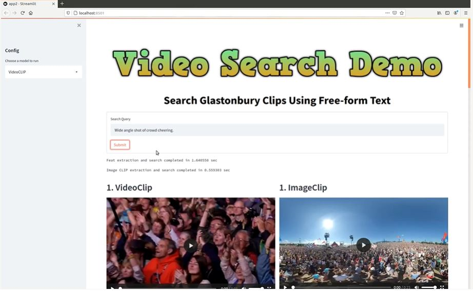

# Video Content Search with Free-form Text Prompts

This repo implements two methods of searching video content using free-form input text prompts **Image CLIP** and **Video CLIP**. It uses the GLASTONBURY dataset, composed of video clips from the Glastonbury festivals in years.

  

The repo contains scripts for
  - Automatic scrapping of YouTube videos with the given search tags
  - Video into meaningful clips using ffmpeg
  - Includes text-based search using Video CLIP and Image CLIP
  -  Streamlit demo app

Video Demo [here](https://www.dropbox.com/home/CVSSP%20Research/ContentTrading?preview=demo.mp4)
